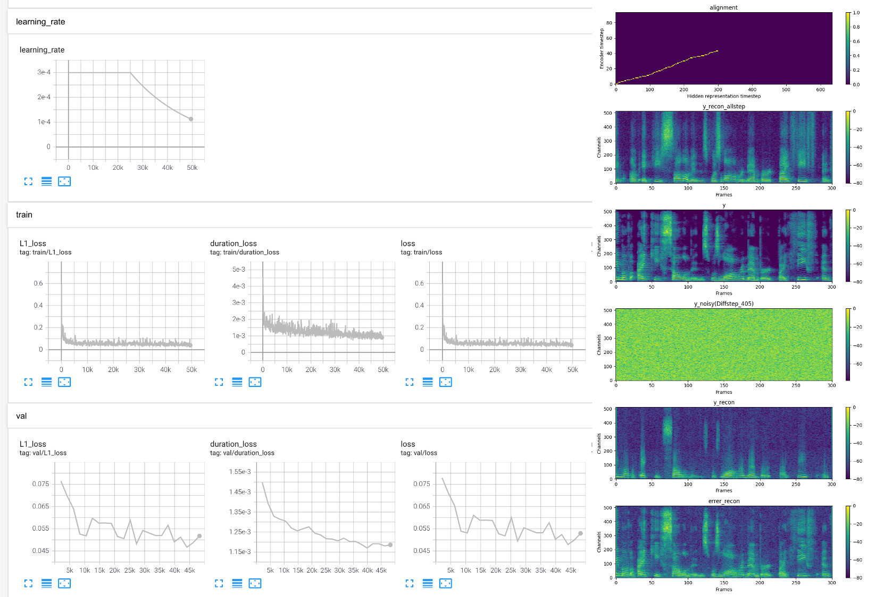

# WaveGrad 2 &mdash; Unofficial PyTorch Implementation

**WaveGrad 2: Iterative Refinement for Text-to-Speech Synthesis**<br>
Unofficial PyTorch+[Lightning](https://github.com/PyTorchLightning/pytorch-lightning) Implementation of Chen *et al.*(JHU, Google Brain), [WaveGrad2](https://arxiv.org/abs/2106.09660).<br>
Audio Samples: https://mindslab-ai.github.io/wavegrad2/<br>

## TODO
- [ ] More training for WaveGrad-Base setup
- [ ] Checkpoint release
- [ ] WaveGrad-Large Decoder
- [ ] Inference by reduced sampling steps

## Requirements
- [Pytorch](https://pytorch.org/) 
- [Pytorch-Lightning](https://github.com/PyTorchLightning/pytorch-lightning)==1.2.10
- The requirements are highlighted in [requirements.txt](./requirements.txt).<br>
- We also provide docker setup [Dockerfile](./Dockerfile).<br>

## Datasets
The supported datasets are
- [LJSpeech](https://keithito.com/LJ-Speech-Dataset/): a single-speaker English dataset consists of 13100 short audio clips of a female speaker reading passages from 7 non-fiction books, approximately 24 hours in total.
- [AISHELL-3](http://www.aishelltech.com/aishell_3): a Mandarin TTS dataset with 218 male and female speakers, roughly 85 hours in total.
- etc.

We take LJSpeech as an example hereafter.
## Preprocessing
- Adjust `preprocess.yaml`, especially `path` section.
```shell script
path:
  corpus_path: '/DATA1/LJSpeech-1.1' # LJSpeech corpus path
  lexicon_path: 'lexicon/librispeech-lexicon.txt'
  raw_path: './raw_data/LJSpeech'
  preprocessed_path: './preprocessed_data/LJSpeech'
``` 

- run `prepare_align.py` for some preparations. 
```shell script
python prepare_align.py -c preprocess.yaml
```

- [Montreal Forced Aligner](https://montreal-forced-aligner.readthedocs.io/en/latest/) (MFA) is used to obtain the alignments between the utterances and the phoneme sequences.
Alignments for the LJSpeech and AISHELL-3 datasets are provided [here](https://drive.google.com/drive/folders/1DBRkALpPd6FL9gjHMmMEdHODmkgNIIK4?usp=sharing).
You have to unzip the files in ``preprocessed_data/LJSpeech/TextGrid/``.

- After that, run `preprocess.py`.
```shell script
python preprocess.py -c preprocess.yaml
```

- Alternately, you can align the corpus by yourself. 
- Download the official MFA package and run it to align the corpus.
```shell script
./montreal-forced-aligner/bin/mfa_align raw_data/LJSpeech/ lexicon/librispeech-lexicon.txt english preprocessed_data/LJSpeech
```
or
```shell script
./montreal-forced-aligner/bin/mfa_train_and_align raw_data/LJSpeech/ lexicon/librispeech-lexicon.txt preprocessed_data/LJSpeech
```

- And then run `preprocess.py`.
```shell script
python preprocess.py -c preprocess.yaml
```
## Training
- Adjust `hparameter.yaml`, especially `train` section.
```yaml
train:
  batch_size: 12 # Dependent on GPU memory size
  adam:
    lr: 3e-4
    weight_decay: 1e-6
  decay:
    rate: 0.05
    start: 25000
    end: 100000
  num_workers: 16 # Dependent on CPU cores
  gpus: 2 # number of GPUs
  loss_rate:
    dur: 1.0
```

- If you want to train with other dataset, adjust `data` section in `hparameter.yaml`
```yaml
data:
  lang: 'eng'
  text_cleaners: ['english_cleaners'] # korean_cleaners, english_cleaners, chinese_cleaners
  speakers: ['LJSpeech']
  train_dir: 'preprocessed_data/LJSpeech'
  train_meta: 'train.txt'  # relative path of metadata file from train_dir
  val_dir: 'preprocessed_data/LJSpeech'
  val_meta: 'val.txt'  # relative path of metadata file from val_dir'
  lexicon_path: 'lexicon/librispeech-lexicon.txt'
```

- run `trainer.py`
```shell script
python trainer.py
```

- During training, tensorboard logger is logging loss, spectrogram and audio.
```shell script
tensorboard --logdir=./tensorboard --bind_all
```


## Inference
- run `inference.py`
```shell script
python inference.py -c <checkpoint_path> --text <text>
```

- Or you can run `wavegrad2_tester.ipynb`.

**Checkpoint file will be released!**

## Note
Since this repo is unofficial implementation and WaveGrad2 paper do not provide several details, a slight differences between paper could exist.  
We listed modifications or arbitrary setups
- Normal LSTM without ZoneOut is applied for encoder. 
- [g2p\_en](https://github.com/Kyubyong/g2p) is applied instead of Google's unknown G2P.
- Trained with LJSpeech datasdet instead of Google's proprietary dataset.
  - Due to dataset replacement, output audio's sampling rate becomes 22.05kHz instead of 24kHz.
- MT + SpecAug are not implemented.
- hyperparameters
  - `train.batch_size: 12` for 2 A100 (40GB) GPUs
  - `train.adam.lr: 3e-4` and `train.adam.weight_decay: 1e-6`
  - `train.decay` learning rate decay is applied during training
  - `train.loss_rate: 1` as `total_loss = 1 * L1_loss + 1 * duration_loss`
  - `ddpm.ddpm_noise_schedule: torch.linspace(1e-6, 0.01, hparams.ddpm.max_step)`
  - `encoder.channel` is reduced to 512 from 1024 or 2048
- Current sample page only contains samples from `WaveGrad-Base` decoder.
- *TODO* things.

## Tree
```
.
├── Dockerfile
├── README.md
├── dataloader.py
├── docs
│   ├── spec.png
│   ├── tb.png
│   └── tblogger.png
├── hparameter.yaml
├── inference.py
├── lexicon
│   ├── librispeech-lexicon.txt
│   └── pinyin-lexicon-r.txt
├── lightning_model.py
├── model
│   ├── base.py
│   ├── downsampling.py
│   ├── encoder.py
│   ├── gaussian_upsampling.py
│   ├── interpolation.py
│   ├── layers.py
│   ├── linear_modulation.py
│   ├── nn.py
│   ├── resampling.py
│   ├── upsampling.py
│   └── window.py
├── prepare_align.py
├── preprocess.py
├── preprocess.yaml
├── preprocessor
│   ├── ljspeech.py
│   └── preprocessor.py
├── text
│   ├── __init__.py
│   ├── cleaners.py
│   ├── cmudict.py
│   ├── numbers.py
│   └── symbols.py
├── trainer.py
├── utils
│   ├── mel.py
│   ├── stft.py
│   ├── tblogger.py
│   └── utils.py
└── wavegrad2_tester.ipynb
```

## Author
This code is implemented by
- [Seungu Han](https://github.com/Seungwoo0326) at MINDs Lab [hansw0326@mindslab.ai](mailto:hansw0326@mindslab.ai)
- [Junhyeok Lee](https://github.com/junjun3518) at MINDs Lab [jun3518@mindslab.ai](mailto:jun3518@mindslab.ai)

Special thanks to 
- [Kang-wook Kim](https://github.com/wookladin) at MINDs Lab 
- [Wonbin Jung](https://github.com/Wonbin-Jung) at MINDs Lab
- [Sang Hoon Woo](https://github.com/tonyswoo) at MINDs Lab

## References
- Chen *et al.*, [WaveGrad 2: Iterative Refinement for Text-to-Speech Synthesis](https://arxiv.org/abs/2106.09660)
- Chen *et al.*,[WaveGrad: Estimating Gradients for Waveform Generation](https://arxiv.org/abs/2009.00713)
- Ho *et al.*, [Denoising Diffusion Probabilistic Models](https://arxiv.org/abs/2006.11239)

This implementation uses code from following repositories:
- [J.Ho's Official DDPM Implementation](https://github.com/hojonathanho/diffusion)
- [lucidrains' DDPM Pytorch Implementation](https://github.com/lucidrains/denoising-diffusion-pytorch)
- [ivanvovk's WaveGrad Pytorch Implementation](https://github.com/ivanvovk/WaveGrad)
- [lmnt-com's DiffWave Pytorch Implementation](https://github.com/lmnt-com/diffwave)
- [ming024's FastSpeech2 Pytorch Implementation](https://github.com/ming024/FastSpeech2)
- [yanggeng1995's EATS Pytorch Implementation](https://github.com/yanggeng1995/EATS)
- [Kyubyoung's g2p\_en](https://github.com/Kyubyong/g2p)
- [mindslab's NU-Wave](https://github.com/mindslab-ai/nuwave)
- [Keith Ito's Tacotron implementation](https://github.com/keithito/tacotron)
- [NVIDIA's Tacotron2 implementation](https://github.com/NVIDIA/tacotron2)

The webpage for the audio samples uses a template from:
- [WaveGrad2 Official Github.io](https://wavegrad.github.io/v2/)

The audio samples on our webpage(TBD) are partially derived from:
- [LJSpeech](https://keithito.com/LJ-Speech-Dataset/): a single-speaker English dataset consists of 13100 short audio clips of a female speaker reading passages from 7 non-fiction books, approximately 24 hours in total.
- [WaveGrad2 Official Github.io](https://wavegrad.github.io/v2/)


